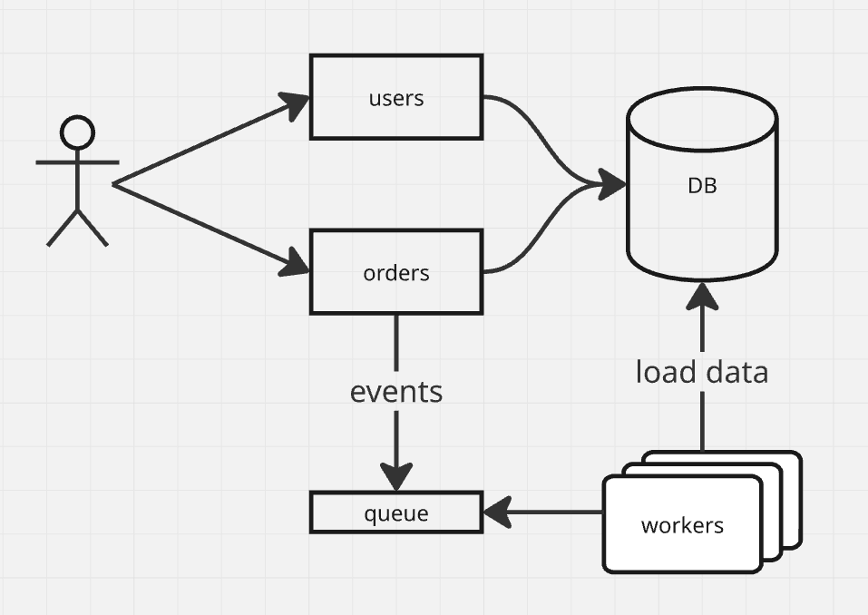

# Desafio técnico

Este projeto visa demonstrar a utilização do Laravel na criação de uma API (microsserviço) para a gestão de um fluxo
básico de pedidos de viagem.

## Tecnologias usadas

| Uso                  | Serviço        | Versão                                        |
|----------------------|----------------|-----------------------------------------------|
| Ambiente de execução | Docker         | 29.3.0                                        |
| Ambiente de dev      | Docker Compose | 5.1.1                                         |
| Runtime              | PHP-fpm        | 8.4.1                                         |
| Banco de dados       | MySQL          | 8.0                                           |
| Filas                | Redis          | 8.6.2                                         |
| Mock de email        | MailHog        | latest (v1.0.1) no momento do desenvolvimento |

O ambiente PHP usado foi instalado via [php.new](https://php.new/)

``` shell
/bin/bash -c "$(curl -fsSL https://php.new/install/linux/8.4)"
```

## Configuração

O projeto foi criado tendo em mente o uso do docker compose para sua execução. Junto com o código, há o compose-file
que define todas as dependências externas, bem como os containeres "worker" que são responsáveis por consumir as filas.

Para iniciar o projeto, primeiro é preciso instalar as dependências:

``` shell
composer install
```

Depois, é necessário iniciar os containers docker via docker compose:

``` shell
docker compose up # Omiti o -d para permitir acompanhar o stdout da execução
```

Ao iniciar os containers, as migrations e os seeders devem executar sem problemas

## Testes

Foram implementados testes unitários para o domínio Order (pedido). Para executálos, podemos usar o comando a seguir:

``` shell
composer test
```

## Linting

Para validar o lint (formatação) do código PHP, é possível executar:

```shell
composer lint
```

Se desejar formatar os arquivos para o padrão definido pelo linter (laravel/pint):

```shell
composer format
```

## Técnicas aplicadas

A funcionalidade "Order", que modela o domínio do pedido foi construída aplicando-se conceitos de DDD 
(Domain-Driven Design), tendo, portanto as seguintes características:

* Entidade de domínio (Order) que implementa o comportamento especificado nos requisitos funcionais
* Value-object representando o status do pedido
* Implementação de uma máquina de estado básica (pdrão de projeto State), para arbitrar as acções de aprovação e cancelamento de um pedido
* Eventos de domínio que são disparados na criação, aprovação e cancelamento de um pedido
* Uma exceção específica lançada quando a ação não é permitida pela regra

A funcionalidade de autenticação foi mantida o mais simples possível, sem aplicação extensa de DDD, dado que não foram
especificados comportamentos ricos para o usuário.

* Foi usado o package `tymon/jwt-auth` para prover a funcionalidade

## Desenho da solução

