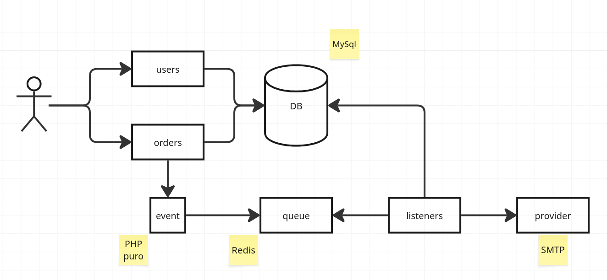
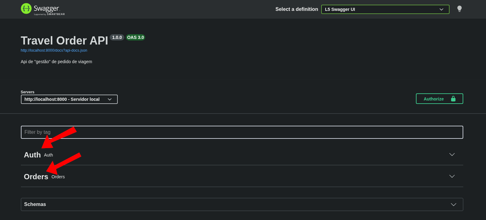
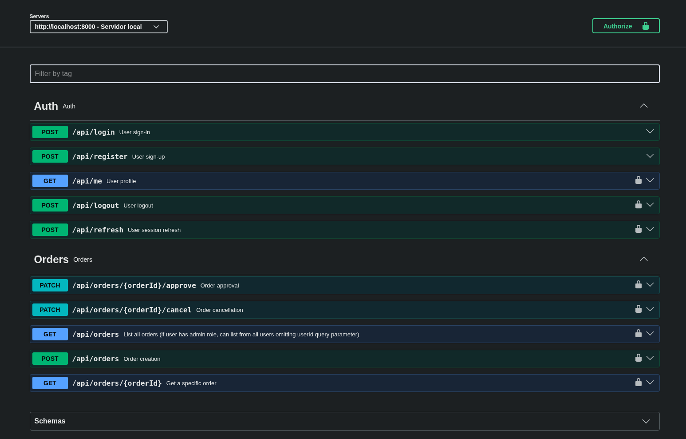

# Desafio técnico

Este projeto visa demonstrar a utilização do Laravel na criação de uma API (microsserviço) para a gestão de um fluxo
básico de pedidos de viagem.

## Desenho da solução


## Caminhos e decisões

Resolvi implementar usando o básico de DDD na funcionalidade de pedidos, bem como alguns conceitos de Arquitetura Limpa
para evitar acoplamento entre o domínio e a infra.

Optei por deixar a entidade de domínio `Order` cuidar da execução da regra de atualização de status (regra de negócio)
para evitar domínio anêmico. Apesar de a aplicação ser pequena o suficiente para não justificar essa abordagem, achei
que seria bom demonstrar a abordagem.

Para a notificação, escolhi usar filas com o driver redis, para separar lógica de domínio de efeito colateral (envio 
da notificação)

Não criei um relacionamento estrito entre as entidades User e Order no banco de dados (apenas coloquei uma coluna 
user_id na tabela orders), visto que, em um cenário real, User e Order muito provavelmente estariam em serviços 
independentes, o que inviabilizaria existirem no mesmo banco de dados.

## Tecnologias usadas

| Uso                  | Serviço        | Versão                                        |
|----------------------|----------------|-----------------------------------------------|
| Ambiente de execução | Docker         | 29.3.0                                        |
| Ambiente de dev      | Docker Compose | 5.1.1                                         |
| Runtime              | PHP-fpm        | 8.4.1                                         |
| Banco de dados       | MySQL          | 8.0                                           |
| Filas                | Redis          | 8.6.2                                         |
| Mock de email        | MailHog        | latest (v1.0.1) no momento do desenvolvimento |

O ambiente PHP usado foi instalado via [php.new](https://php.new/)

``` shell
/bin/bash -c "$(curl -fsSL https://php.new/install/linux/8.4)"
```

## Configuração

O projeto foi criado tendo em mente o uso do docker compose para sua execução. Junto com o código, há o compose-file
que define todas as dependências externas, bem como os containeres "worker" que são responsáveis por consumir as filas.

Para iniciar o projeto, primeiro é preciso instalar as dependências:

``` shell
composer install
```

Depois, é necessário iniciar os containers docker via docker compose:

``` shell
docker compose up # Omiti o -d para permitir acompanhar o stdout da execução
```

Ao iniciar os containers, as migrations e os seeders devem executar sem problemas

## Testes

Foram implementados testes unitários para o domínio Order (pedido). Para executá-los, podemos usar o comando a seguir:

``` shell
composer test
```

## Linting

Para validar o lint (formatação) do código PHP, é possível executar:

```shell
composer lint
```

Se desejar formatar os arquivos para o padrão definido pelo linter (laravel/pint):

```shell
composer format
```

## OpenAPI

Foi usada a biblioteca [darkaonline/l5-swagger](https://github.com/darkaonline/l5-swagger) para fornecer a documentação
interativa para a api.

Com o projeto em execução, é possível acessar a documentação pelo link 
[http://localhost:8000/api/documentation](http://localhost:8000/api/documentation).

Se a documentação abrir com as tags colapsadas, como na imagem abaixo, basta clicar em Auth e Orders para mostar os
endpoints.





## O que foi produzido

A funcionalidade "Order", que modela o domínio do pedido foi construída aplicando-se conceitos de DDD 
(Domain-Driven Design), tendo, portanto as seguintes características:

* Entidade de domínio (Order) que implementa o comportamento especificado nos requisitos funcionais
* Value-object representando o status do pedido
* Implementação de uma máquina de estado básica (pdrão de projeto State), para arbitrar as acções de aprovação e cancelamento de um pedido
* Eventos de domínio que são disparados na criação, aprovação e cancelamento de um pedido
* Uma exceção específica lançada quando a ação não é permitida pela regra

A funcionalidade de autenticação foi mantida o mais simples possível, sem aplicação extensa de DDD, dado que não foram
especificados comportamentos ricos para o usuário.

* Foi usado o package `tymon/jwt-auth` para prover a funcionalidade

Para desacoplar os processos de aprovação e cancelamento dos efeitos colaterais (notificações), foi escolhida uma
abordagem de filas, em que as notificações são executadas de forma assíncrona e independente da requisição do usuário.

Para alcançar esse desacoplamento com DDD, a entidade de domínio é responsável por registrar internamente os fatos
relevantes, e, após a execução da regra de negócio, é solicitada a retornar os eventos representando esses fatos.

Foi criada uma interface de EventBus (único objeto no contexto de domínio "Shared") que define os métodos para despachar
os eventos (dispatch e dispatchAll). Dessa forma, a implementção fica separada da abstração, impedindo o acoplamento
entre o domínio e o framework.

Os eventos de domínio são despachados por meio da interface EventBus, de forma a serem enfileirados para processamento.

Para as filas, foi usado o Redis, sendo consumido por um container separado executando a rotina de consumo via artisan:

``` shell
php artisan queue:work redis --queue=mail
```

As filas são processadas por três listeners:
* SendOrderCreatedMailNotification
* SendOrderApprovedMailNotification
* SendOrderCanceledMailNotification

O envio é feito via SMTP para um mock de email. Para que possa ser validado, pode-se acessar a interface de "webmail"
via [http://localhost:8100/](http://localhost:8100/).

Foram criados templates blade básicos para demonstração.
